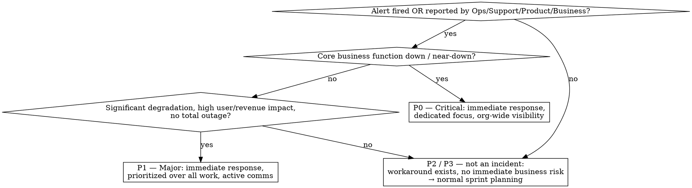

# Yassir Mobility Incident Response

The single most important goal: **fix fast, communicate clearly, learn once — so we don't repeat the same incident twice.** This is a **blameless, action-oriented** process. Fix first, analyse later. Over-communicate. Speed + structure beats heroics.

This skill covers the Yassir-specific lifecycle and the concrete artefacts. For the _craft_ of writing the postmortem document (blameless narrative, root-cause depth, action items that get done), this skill **hands off to the `postmortem` skill** — this skill only adds the Yassir-specific requirements on top.

Concrete links, channel IDs, Slack templates, the Notion post-mortem template, and Jira tracking rules live in `references/yassir-specifics.md` — read it before you post anything to a channel or file a ticket.

## The five stages

1. **Monitoring & Alerting** — Datadog is the single source of truth (metrics, logs, traces, alerts, dashboards).
2. **Identification & Severity** — assess _impact_, not root cause, and assign a severity.
3. **Active Response** — an Incident Commander runs the incident; comms flow through the incident channel + status channel.
4. **Resolution & Recovery** — deploy the fix, confirm systems healthy, announce resolution.
5. **Post-Mortem & Follow-Up** — same-day (max 48h) blameless doc; action items tracked to closure in Jira.

## When something becomes an incident, and how severe

**Assess impact first, not root cause.** Severity examples (Mobility/Delivery context) and the full definitions are in `references/yassir-specifics.md`. Only **P0** and **P1** trigger this incident process; P2/P3 go through normal sprint work.

## What Claude does at each stage

- **Triage / classify:** given the symptoms, propose a severity with a one-line justification tied to impact (who/what is affected, how much). Flag if it's P2/P3 and doesn't need the incident process.
- **Declare (P0/P1):** draft the incident-channel name (`#incident-<date>-<scope>`) and the status-channel announcement using the template in the reference file. Never post automatically — produce the text for a human to send.
- **Run support (IC is human):** the Incident Commander runs the incident and is _not_ the main debugger. Claude helps by maintaining the live timeline (timestamped decisions/events), drafting short factual status updates, and tracking assigned tasks. Keep all substance in the incident channel — no side threads.
- **Resolution:** confirm the resolution criteria are met (fix deployed, systems confirmed healthy via monitoring, impact gone) before drafting the resolution announcement.
- **Post-mortem:** produce the doc (see below).

## Post-mortem (Stage 5) — Yassir requirements

**Hand off to the `postmortem` skill for the doc-writing craft**, then enforce these Yassir specifics on top:

- **Timing:** create the doc the **same day, max within 48 hours** — fresh context is critical.
- **Canonical template:** the Yassir Notion post-mortem template (linked in the reference file). Produce Markdown locally first; publish to Notion under that template only when asked.
- **Required sections (all must be present):** 1) Incident summary, 2) Severity & impact, 3) Timeline (detection → resolution), 4) What went well, 5) What didn't go well, 6) Root causes (technical _and_ process), 7) Action items. The generic postmortem template is a superset — keep these seven, blameless throughout.
- **Action items:** each has an **owner** and a **Jira ticket with component = `Postmortem`** on the CMB Postmortem board. Prefer system changes over "be more careful."
- **Closure:** the post-mortem is **done only when all action items are completed** — reviewed at the domain-wide incident meeting.

## Quick reference

| Need                                          | Where                                              |
| --------------------------------------------- | -------------------------------------------------- |
| Observability / source of truth               | Datadog                                            |
| Severity definitions + Mobility examples      | `references/yassir-specifics.md`                   |
| Incident channel naming                       | `#incident-<date>-<scope>`                         |
| Status/announcement channel + Slack templates | `references/yassir-specifics.md`                   |
| Who is IC (default order)                     | EM of scope → Tech Lead → any senior engineer      |
| Post-mortem template + Jira board             | `references/yassir-specifics.md`                   |
| Writing the postmortem doc (craft)            | `postmortem` skill                                 |
| Hotfix / Security / Runbooks / Fire Drill     | Appendix links in `references/yassir-specifics.md` |

## Common mistakes

- **Chasing root cause before assessing impact.** Severity and comms come first; diagnosis comes after.
- **Silence.** "We're investigating" beats no update. Notify stakeholders early via the status channel.
- **Auto-posting.** Claude drafts announcements; a human sends them. Don't post to Slack/Notion/Jira without being asked.
- **Blame.** Write about systems and decisions, not individuals. Name roles ("the on-call engineer"), not fault.
- **Treating a P2/P3 as an incident** (or a real P0 as routine). Anchor severity to actual business impact.
- **Dropping post-mortem sections.** Keep all seven; mark genuine unknowns as unknowns rather than inventing them.
- **Untracked action items.** No owner or no Jira ticket (component = `Postmortem`) means it won't get done.
